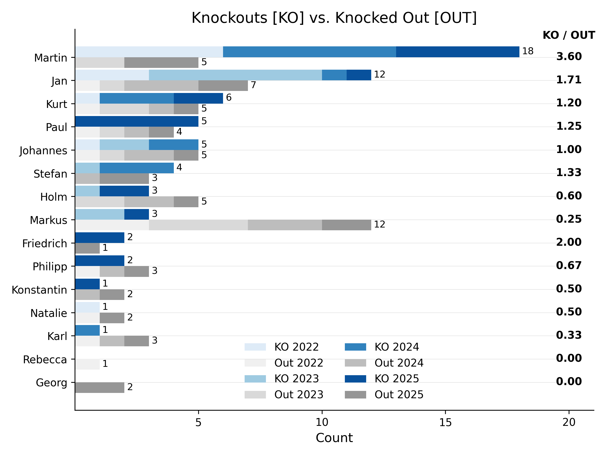
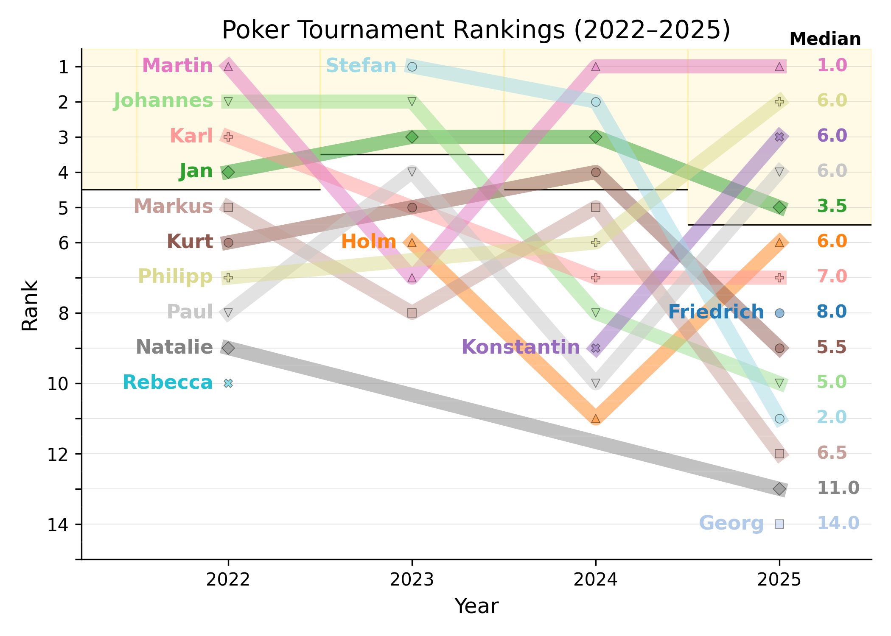

# 🃏 Poker Tournament Analysis (2022–2025)

A data-driven deep dive into our recurring poker tournament series. This project automates the calculation of player earnings, rankings, and knockout efficiency across multiple years of historical data.

## 📊 Performance Gallery

### 1. Cumulative Earnings
This plot tracks the "all-time" financial health of each player. It calculates cumulative profit/loss based on buy-ins, rebuys, and prize pool distributions.

### 2. Historical Rankings
A bump chart showing how player standings have evolved over the years. 

### 3. Knockout Efficiency
Comparison of total knockouts (KO) delivered versus how many times a player was knocked out (OUT), including a performance ratio.

## 🛠️ Project Structure
- `poker_logic.py`: Core calculation engine for net earnings and stats.
- `data_definitions.py`: Centralized styling (colors, font sizes) and file paths.
- `poker_data.csv`: The primary dataset.
- `poker_rules.json`: Yearly configuration for buy-ins and bounty values.